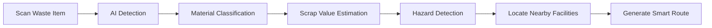

<div align="center">


# Recicla

https://recicla-devkada.vercel.app/


<br/>


<br/><br/>


<br/><br/>

### Intelligent Waste Recognition & Recycling Platform for the Philippines

Recicla is a next-generation sustainability platform that combines:

- Artificial Intelligence  
- Computer Vision  
- Smart Geolocation  
- Sustainable Disposal Systems  

to modernize waste management and recycling accessibility in the Philippines.

The platform enables users to:

- Detect recyclable materials in real-time  
- Estimate recyclable market value in Philippine Pesos (₱)  
- Identify hazardous waste and e-waste  
- Locate nearby recycling centers and junkshops  
- Generate intelligent disposal routes instantly  

all within a seamless and immersive web experience.

<br/>


</div>

---

# Core Features

# Real-Time AI Waste Recognition

Recicla leverages advanced browser-based AI technologies including:

- TensorFlow.js
- COCO-SSD
- Teachable Machine
- Groq API
- Meta Llama AI

to perform intelligent recyclable material recognition directly in the browser.

### Features:
- Live camera scanning
- Real-time object tracking
- Browser-side AI inference
- Waste classification system
- Bounding-box detection
- Material identification

---

# Smart Scrap Valuation System

The AI system analyzes recyclable materials and estimates their approximate value.

The analysis includes:
- Material valuation
- Recycling insights
- Sustainability suggestions
- Upcycling recommendations
- Smart waste analysis

---

# Hazard Detection & Safety Awareness

Recicla detects potentially dangerous recyclable materials such as:

- Batteries
- Toxic containers
- E-waste
- Damaged electronics
- Hazardous materials

The platform then provides:
- Disposal guidance
- Safety instructions
- Hazard alerts
- Environmental awareness tips

---

# Smart Recycling Locator

Recicla intelligently locates nearby:

- Junkshops
- Recycling facilities
- Scrap centers
- E-waste disposal sites

using:
- OpenStreetMap
- Overpass API
- Smart geolocation
- Distance-aware filtering

---

# Interactive Maps & Navigation

The navigation system is powered by:

- Leaflet
- React Leaflet
- OSRM Routing API

### Features:
- Interactive maps
- Real-time routing
- User location tracking
- Smart route generation
- Disposal navigation system

---

# Modern UI / UX Experience

Recicla provides a modern and immersive user experience powered by:

| Technology | Purpose |
|---|---|
| **GSAP** | Smooth animations & transitions |
| **React Lenis** | Fluid scrolling system |
| **Tailwind CSS** | Responsive UI styling |
| **Figma** | UI / UX prototyping |

### UI Highlights:
- Smooth animations
- Scroll-triggered effects
- Interactive hover transitions
- Mobile-first responsive design
- Modern glassmorphism aesthetics
- Fluid page interactions

---

# System Workflow



---

# Complete Tech Stack

# Frontend & UI

| Technology | Description |
|---|---|
| **Next.js** | Full-stack React framework |
| **React.js** | Interactive user interfaces |
| **Tailwind CSS** | Utility-first CSS framework |
| **GSAP** | High-performance animation engine |
| **React Lenis** | Smooth scrolling library |
| **Figma** | UI / UX design tool |

---

# Artificial Intelligence & Machine Learning

| Technology | Description |
|---|---|
| **TensorFlow.js** | Browser-side machine learning |
| **COCO-SSD** | Real-time object detection |
| **Teachable Machine** | Custom waste classification model |
| **Meta Llama AI** | AI-powered analysis & recommendations |
| **Groq API** | Ultra-fast AI inference |

---

# Mapping & Geolocation

| Technology | Description |
|---|---|
| **Leaflet.js** | Interactive map rendering |
| **React Leaflet** | React map integration |
| **OpenStreetMap** | Open-source geographic data |
| **Overpass API** | Nearby recycling facility queries |
| **Nominatim API** | Reverse geocoding |
| **Photon API** | Address autocomplete |
| **OSRM API** | Navigation & route optimization |

---

# Backend & Infrastructure

| Technology | Description |
|---|---|
| **Node.js** | Runtime environment |
| **Supabase** | Database & image storage |
| **Vercel** | Deployment platform |

---

# Application Preview

<div align="center">

| AI Waste Detection | Smart Material Analysis |
|---|---|

| Smart Recycling Map | Route Navigation |
|---|---|

</div>

---

# Installation & Setup

# 1. Clone Repository

```bash
git clone https://github.com/JudeGaringalo/recicla.git

cd recicla
```

---

# 2. Install Dependencies

```bash
npm install
```

or

```bash
yarn install
```

---

# 3. Configure Environment Variables

Create a `.env.local` file:

```env
NEXT_PUBLIC_SUPABASE_URL=your_supabase_url

NEXT_PUBLIC_SUPABASE_ANON_KEY=your_supabase_anon_key

SUPABASE_SERVICE_ROLE_KEY=your_service_role_key

GROQ_API_KEY=your_groq_api_key
```

---

# 4. Start Development Server

```bash
npm run dev
```

Open:

```bash
http://localhost:3000
```

---

# Project Structure

```bash
recicla/
│
├── app/
├── components/
├── hooks/
├── lib/
├── utils/
├── styles/
├── public/
│   ├── images/
│   ├── screenshots/
│   ├── models/
│   └── demo/
├── types/
├── package.json
└── README.md
```

---

# Future Improvements

- Nationwide live junkshop database
- Progressive Web App (PWA)
- Improved AI detection accuracy
- Carbon footprint analytics
- Gamified recycling rewards
- Sustainability dashboard
- Recycling reminders
- Community-powered reporting system
- Smart waste collection integration

---

# Team — Malunggay Pandesal

| Member | Role |
|---|---|
| **Jude** | Full-Stack Software Developer |
| **Bam** | AI Engineer |
| **Volt** | UI / UX Designer |
| **Sai** | QA Engineer |

---

# Vision

Recicla aims to encourage smarter recycling habits by making waste identification, valuation, and disposal more accessible through Artificial Intelligence and modern web technologies.

The platform bridges:
- Sustainability
- Smart waste management
- Environmental awareness
- AI-powered recycling systems

to help build greener Filipino communities.

---

# Why Recicla Matters

Millions of tons of recyclable waste are improperly disposed of every year due to:

- Lack of awareness
- Poor recycling accessibility
- Limited waste identification knowledge
- Inefficient disposal systems

Recicla solves these challenges through:

- Artificial Intelligence  
- Computer Vision  
- Smart Geolocation  
- Real-Time Waste Detection  
- Intelligent Disposal Navigation  

---

# Developed For

## CodeKada Online Hackathon 2026

<div align="center">

# Turning Waste Into Opportunity Through AI

</div>

---

# Support The Project

If you found this project useful:

- Star the repository  
- Fork the project  
- Contribute improvements  
- Promote sustainable technology  

---

# License

This project is unlicensed and was created exclusively for the CodeKada Online Hackathon 2026.

---

<div align="center">

### Made with AI and Sustainability in Mind

</div>

> **Disclaimer**
>
> Recicla is an experimental academic and sustainability-focused platform developed for the **CodeKada Online Hackathon 2026**.  
>
> The AI-powered waste detection, material classification, price estimation, and recycling recommendations provided by the system are intended for **educational, research, and informational purposes only**.
>
> Please note:
>
> - AI predictions and classifications may not always be 100% accurate.
> - Scrap value estimations are approximate and may vary depending on local market conditions, junkshops, and recycling facilities.
> - Nearby recycling centers, routes, and geolocation data rely on third-party mapping services and public datasets which may contain incomplete or outdated information.
> - Users are encouraged to verify hazardous waste handling procedures with official environmental agencies and local authorities before disposal.
>
> Recicla and its developers are not liable for:
>
> - Incorrect AI detections
> - Inaccurate pricing estimates
> - Mapping inaccuracies
> - Third-party service interruptions
> - Improper disposal decisions made using the platform
>
> By using Recicla, users acknowledge that the platform is provided **“as is”** without warranties of any kind and should be used responsibly to support sustainable waste management practices.
