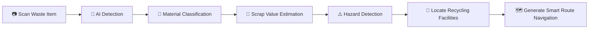

<div align="center">

# ♻️ Recicla


<br/>


<br/><br/>


<br/><br/>

### 🌱 Intelligent Waste Recognition & Recycling Platform for the Philippines

Recicla AI is an AI-powered sustainability platform designed to modernize waste management and recycling accessibility through the power of:

🤖 Artificial Intelligence  
🧠 Computer Vision  
📍 Smart Geolocation  
♻️ Sustainable Disposal Systems  

The platform enables users to identify recyclable materials in real-time, estimate scrap value in Philippine Pesos (₱), detect hazardous waste, and discover nearby recycling facilities with intelligent route navigation — all inside a modern and immersive web experience.

<br/>


</div>

---

# ✨ Core Features

## 🤖 Real-Time AI Waste Detection

Recicla combines:

- **TensorFlow.js**
- **COCO-SSD**
- **Teachable Machine**
- **Meta Llama 3**
- **Groq API**

to deliver fast and intelligent browser-based waste recognition.

### Features:
- Real-time camera scanning
- Live object tracking
- AI-powered material classification
- Browser-side machine learning
- Bounding box detection
- Smart recyclable identification

---

## 💸 Smart Scrap Valuation

Recicla intelligently estimates:

### 🇵🇭 Recyclable Market Value in Philippine Pesos (₱)

The AI system generates:
- Material value estimation
- Recycling recommendations
- Upcycling suggestions
- Sustainability insights
- Smart waste analysis

---

## ⚠️ Hazard Detection System

The platform detects:
- Batteries
- Toxic waste
- E-waste
- Damaged electronics
- Hazardous recyclable materials

and provides:
- Disposal guidance
- Hazard warnings
- Environmental safety tips
- Proper handling instructions

---

# 📍 Smart Recycling Locator

Recicla helps users locate nearby:

- Junkshops
- Recycling facilities
- Scrap centers
- E-waste disposal sites

using:
- Real-time geolocation
- OpenStreetMap
- Overpass API
- Intelligent distance filtering

---

# 🗺️ Interactive Mapping & Navigation

Powered by:
- Leaflet
- React Leaflet
- OSRM Routing API

Features include:
- Live map rendering
- Route optimization
- User tracking
- Smart navigation
- Distance calculations
- Real-time route generation

---

# 🎨 Modern UI / UX Experience

Recicla delivers an immersive and fluid experience powered by:

| Technology | Purpose |
|---|---|
| **GSAP** | Smooth animations and transitions |
| **React Lenis** | Fluid smooth-scrolling system |
| **Tailwind CSS** | Modern responsive styling |
| **React** | Dynamic UI rendering |

### UI Highlights:
- Smooth page transitions
- Scroll-triggered animations
- Interactive hover effects
- Responsive mobile-first design
- Modern glassmorphism aesthetics
- Fluid user interactions

---

# 🧠 How Recicla Works



---

# 🛠️ Complete Tech Stack

# 🎨 Frontend & UI

| Technology | Description |
|---|---|
| **Next.js** | Full-stack React framework |
| **React.js** | User interface library |
| **Tailwind CSS** | Utility-first CSS framework |
| **GSAP** | Animation engine |
| **React Lenis** | Smooth scrolling |
| **Lucide React** | Icon system |

---

# 🤖 Artificial Intelligence & Machine Learning

| Technology | Description |
|---|---|
| **TensorFlow.js** | Browser-based AI inference |
| **COCO-SSD** | Object detection model |
| **Teachable Machine** | Custom recyclable classifier |
| **Meta Llama 3** | AI-powered analysis |
| **Groq API** | Ultra-fast LLM inference |

---

# 🗺️ Mapping & Geolocation

| Technology | Description |
|---|---|
| **Leaflet.js** | Interactive map rendering |
| **React Leaflet** | React-based map integration |
| **OpenStreetMap** | Geographic map data |
| **Overpass API** | Nearby recycling queries |
| **Photon API** | Address autocomplete |
| **Nominatim API** | Reverse geocoding |
| **OSRM API** | Navigation & routing |

---

# ☁️ Backend & Infrastructure

| Technology | Description |
|---|---|
| **Node.js** | Runtime environment |
| **Supabase** | Database & image storage |
| **Vercel** | Deployment platform |

---

# 📸 Application Preview

<div align="center">

| AI Detection | Material Analysis |
|---|---|

| Smart Recycling Map | Route Navigation |
|---|---|

</div>

---

# ⚙️ Installation & Setup

# 1️⃣ Clone Repository

```bash
git clone https://github.com/your-username/recicla.git

cd recicla
```

---

# 2️⃣ Install Dependencies

```bash
npm install
```

or

```bash
yarn install
```

---

# 3️⃣ Configure Environment Variables

Create a `.env.local` file:

```env
NEXT_PUBLIC_SUPABASE_URL=your_supabase_url

NEXT_PUBLIC_SUPABASE_ANON_KEY=your_supabase_anon_key

SUPABASE_SERVICE_ROLE_KEY=your_service_role_key

GROQ_API_KEY=your_groq_api_key
```

---

# 4️⃣ Run Development Server

```bash
npm run dev
```

Open:

```bash
http://localhost:3000
```

---

# 📂 Project Structure

```bash
recicla/
│
├── app/
├── components/
├── hooks/
├── lib/
├── utils/
├── styles/
├── public/
│   ├── screenshots/
│   ├── models/
│   └── demo/
├── types/
├── package.json
└── README.md
```

---

# 🚀 Future Improvements

- ♻️ Nationwide live junkshop database
- 📱 Progressive Web App (PWA)
- 🧠 Improved AI waste recognition
- 🌍 Carbon footprint tracking
- 🏆 Gamified sustainability system
- 📊 Recycling analytics dashboard
- 🔔 Smart recycling reminders
- 🤝 Community-powered reporting
- 📦 Smart waste collection integration

---

# 👨‍💻 Team — Malunggay Pandesal

| Member | Role |
|---|---|
| **Jude** | Full-Stack Software Developer |
| **Bam** | AI Engineer |
| **Volt** | UI / UX Designer |
| **Sai** | Project Manager |

---

# 🌱 Vision

Recicla AI aims to encourage smarter recycling habits by making waste identification, valuation, and disposal more accessible through Artificial Intelligence and modern web technologies.

The platform bridges:
- Sustainability
- Smart waste management
- AI-powered recycling
- Environmental awareness

to help build greener Filipino communities.

---

# 📈 Why Recicla Matters

Millions of tons of recyclable waste are improperly disposed of every year because of:

- Lack of awareness
- Poor recycling accessibility
- Limited waste identification knowledge
- Inefficient disposal systems

Recicla AI solves these challenges through:

✅ Artificial Intelligence  
✅ Computer Vision  
✅ Smart Mapping Systems  
✅ Real-Time Recycling Guidance  
✅ Intelligent Disposal Navigation  

---

# 🏆 Developed For

## CodeKada Online Hackathon 2026

<div align="center">

# ♻️ Turning Waste Into Opportunity Through AI

</div>

---

# ⭐ Support The Project

If you found this project useful:

🌟 Star the repository  
🍴 Fork the project  
🛠️ Contribute improvements  
♻️ Promote sustainable technology  

---

# 📄 License

This project is licensed under the MIT License.

---

<div align="center">

### Made with ♻️, AI, and Sustainability in Mind

</div>
