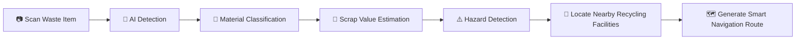

<div align="center">

# ♻️ Recicla AI


<br/>


<br/><br/>


<br/><br/>

### 🌱 Intelligent Waste Recognition & Recycling Platform

Recicla AI is a next-generation sustainability platform designed to modernize waste management and recycling accessibility in the Philippines through the power of **Artificial Intelligence**, **Computer Vision**, and **Smart Geolocation Systems**.

The platform enables users to:

♻️ Identify recyclable waste in real-time  
💸 Estimate recyclable market value in Philippine Pesos (₱)  
⚠️ Detect hazardous materials and e-waste  
📍 Locate nearby recycling centers and junkshops  
🗺️ Generate intelligent disposal routes instantly  

—all inside a seamless and modern web application.

<br/>


</div>

---

# ✨ Core Features

## 🤖 Real-Time AI Waste Recognition

Recicla uses advanced computer vision models powered by:

- **TensorFlow.js**
- **COCO-SSD**
- **Teachable Machine**
- **Meta Llama 3 AI**

to detect, classify, and analyze waste materials directly in the browser with near real-time performance.

### Features:
- Live camera-based scanning
- Object bounding & tracking
- Material classification
- Browser-side AI inference
- Lightweight AI processing

---

## 💸 Smart Scrap Valuation System

The platform intelligently estimates recyclable material value in:

### 🇵🇭 Philippine Peso (₱)

Using:
- Material analysis
- AI-generated valuation
- Market-aware recycling insights

Users also receive:
- Upcycling suggestions
- Reuse recommendations
- Recycling tips
- Sustainability guidance

---

## ⚠️ Hazard Detection & Waste Safety

Recicla identifies potentially dangerous materials such as:

- Batteries
- E-waste
- Toxic containers
- Damaged electronics
- Hazardous recyclable items

The system then provides:
- Safety precautions
- Proper disposal instructions
- Recycling warnings
- Environmental awareness guidance

---

# 📍 Smart Recycling Locator

Recicla automatically locates nearby:

- Junkshops
- Recycling facilities
- Scrap centers
- E-waste drop-off points

using:
- Real-time geolocation
- OpenStreetMap data
- Overpass API
- Intelligent distance filtering

---

# 🗺️ Interactive Routing & Navigation

The application generates optimized navigation routes through:

- **Leaflet**
- **React Leaflet**
- **OSRM Routing API**

Features include:
- Real-time route generation
- User location tracking
- Distance calculations
- Interactive live maps
- Disposal facility navigation

---

# 🎨 Modern User Experience

Recicla features a fully responsive and immersive UI powered by:

- Tailwind CSS
- GSAP animations
- React Lenis smooth scrolling

Designed with:
- Modern glassmorphism aesthetics
- Mobile responsiveness
- Smooth interactions
- Accessibility optimization
- Fluid animations

---

# 🧠 System Workflow



---

# 🛠️ Complete Tech Stack

# 🎨 Frontend & UI

| Technology | Purpose |
|---|---|
| **Next.js** | Full-stack React framework |
| **React.js** | User interface rendering |
| **Tailwind CSS** | Utility-first CSS framework |
| **GSAP** | Animation engine |
| **React Lenis** | Smooth scrolling experience |
| **Lucide React** | Modern icon system |

---

# 🤖 Artificial Intelligence & Machine Learning

| Technology | Purpose |
|---|---|
| **TensorFlow.js** | Browser-based machine learning |
| **COCO-SSD** | Real-time object detection |
| **Teachable Machine** | Custom waste classification model |
| **Meta Llama 3 AI** | AI-generated analysis and recommendations |
| **Groq API** | Ultra-fast Llama inference |

---

# 🗺️ Mapping & Geolocation

| Technology | Purpose |
|---|---|
| **Leaflet.js** | Interactive maps |
| **React Leaflet** | React-based map rendering |
| **OpenStreetMap** | Open-source geographic data |
| **Overpass API** | Nearby recycling facility queries |
| **Nominatim API** | Reverse geocoding |
| **Photon API** | Address autocomplete |
| **OSRM API** | Route optimization and navigation |

---

# ☁️ Backend & Infrastructure

| Technology | Purpose |
|---|---|
| **Node.js** | Runtime environment |
| **Supabase** | Database & image storage |
| **Vercel** | Deployment platform |

---

# 📸 Application Preview

<div align="center">

| AI Detection | Smart Material Analysis |
|---|---|
|  |  |

| Recycling Map | Route Navigation |
|---|---|
|  |  |

</div>

---

# ⚙️ Installation & Setup

# 1️⃣ Clone Repository

```bash
git clone https://github.com/your-username/recicla.git

cd recicla
```

---

# 2️⃣ Install Dependencies

```bash
npm install
```

or

```bash
yarn install
```

---

# 3️⃣ Configure Environment Variables

Create a `.env.local` file:

```env
NEXT_PUBLIC_SUPABASE_URL=your_supabase_url

NEXT_PUBLIC_SUPABASE_ANON_KEY=your_supabase_anon_key

SUPABASE_SERVICE_ROLE_KEY=your_service_role_key

GROQ_API_KEY=your_groq_api_key
```

---

# 4️⃣ Start Development Server

```bash
npm run dev
```

Open:

```bash
http://localhost:3000
```

---

# 📂 Project Structure

```bash
recicla/
│
├── app/
├── components/
├── hooks/
├── lib/
├── utils/
├── styles/
├── public/
│   ├── screenshots/
│   ├── models/
│   └── demo/
├── types/
├── package.json
└── README.md
```

---

# 🚀 Future Improvements

- ♻️ Live nationwide junkshop database
- 📱 Progressive Web App (PWA)
- 🧠 Improved AI waste classification
- 🌍 Carbon footprint analytics
- 🏆 Recycling reward system
- 📊 Smart sustainability dashboard
- 🔔 Recycling reminders
- 🤝 Community-powered reporting system
- 📦 Smart waste collection integration

---

# 👨‍💻 Team — Malunggay Pandesal

| Member | Role |
|---|---|
| **Jude** | Full-Stack Software Developer |
| **Bam** | AI Engineer |
| **Volt** | UI / UX Designer |
| **Sai** | Project Manager |

---

# 🌱 Vision

Recicla AI aims to encourage smarter recycling habits by making waste identification, valuation, and proper disposal more accessible through Artificial Intelligence and modern web technologies.

The platform bridges the gap between:
- Environmental awareness
- Recycling accessibility
- Smart sustainability systems

to empower Filipino communities toward a greener future.

---

# 📈 Why Recicla Matters

Millions of tons of recyclable waste are improperly disposed of every year due to:

- Lack of awareness
- Poor accessibility to recycling centers
- Limited recycling knowledge
- Inefficient disposal systems

Recicla AI solves this by combining:

✅ Artificial Intelligence  
✅ Real-Time Computer Vision  
✅ Smart Mapping Systems  
✅ Sustainable Disposal Guidance  

into one intelligent and accessible platform.

---

# 🏆 Developed For

## CodeKada Online Hackathon 2026

<div align="center">

# ♻️ Turning Waste Into Opportunity Through AI

</div>

---

# ⭐ Support The Project

If you found this project useful:

🌟 Star the repository  
🍴 Fork the project  
🛠️ Contribute improvements  
♻️ Promote sustainable technology  

---

# 📄 License

This project is licensed under the MIT License.

---

<div align="center">

### Made with ♻️, AI, and Sustainability in Mind

</div>
